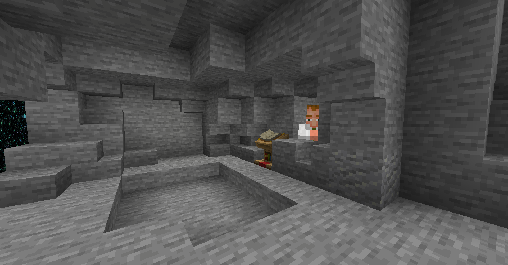

<h1 style="text-decoration:underline;">MiniGames</h1>

Welcome! Here, you Can View Screenshots Of The Map And A bunch Of Info About It

heres Some Screenshots Of The Minigames Map

This Project Has Been Started At Around The Start Of 2020 (1.14), and yes it was made in bedrock so it can only be played on there.
well... Unless You Use Something To Convert It Into A Java World.

ㅤ

<h1 style="text-decoration:underline;">Minigames</h1>

ㅤ

ㅤ

Parkour

ㅤ

The Beggining Of The Map

ㅤ

The Dungeons First Level

Dungeon Hub

ㅤ

Glide

ㅤ

Tumble

ㅤ

Pvp

ㅤ

PvE

ㅤ

Block Party

ㅤ

Bridges

ㅤ

Egg/Bedwars

ㅤ

SkyWars

ㅤ

Capture The Flag

ㅤ

ㅤ

ㅤ

<h1 style="text-decoration:underline;">Extras</h1>

ㅤ

ㅤ

Quests

ㅤ

Quests Can Give You Rewards For Doing Stuff In The Minigames Map.

NPCs and Villagers Usally Hold Quests

They Might Require You To;

Complete A Level

Win A Game

Get A Kill In Pvp Or PvE

Comnplete Something With A Limited Amount Of Time

ㅤ

Theres Also Rewards Like;

In Game Currency

Kits

Maps

Even More Quests 

ㅤ

Currency

ㅤ

The Currency is Used To Buy Lots Of Things In Game, 

The Currency Is Called 'Gamer Token' .

You Can Use It To Buy Stuff Like;

More Maps

Kits

Unlock More Kits

Unlock More Gamemodes

+More

ㅤ

Unlocking Maps

ㅤ

Coming Soon!

ㅤ

ㅤ

ㅤㅤ<a href="https://www.youtube.com/channel/UCIaUjRKg92Df9VeBxrXjv5A">Youtube</a>ㅤㅤㅤ<a href="https://twitch.tv/tech_g4mer">Twitch</a>ㅤㅤㅤ<a href="https://github.com/TechG4mer">Github</a>ㅤㅤㅤ<a href="https://twitter.com/tech_g4mer">Twitter</a>ㅤㅤㅤㅤ<a href="https://www.facebook.com/Tech-Gang-102858845215452">Facebook</a>ㅤㅤㅤ<a href="https://www.reddit.com/user/TechGamer_YT">Reddit</a>ㅤㅤㅤ<a href="https://discord.gg/bVH2kUEfnv">Discord Main</a>ㅤㅤㅤ<a href="https://discord.gg/97C2v9rNVt">Discord Support</a>ㅤㅤㅤ

